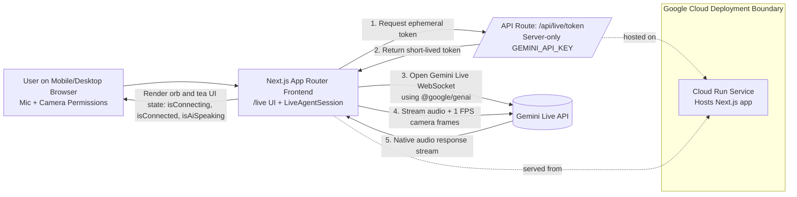
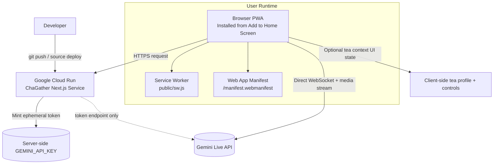

# ChaGather

Traditional Gongfu tea master meets Gemini Live multimodal AI. ChaGather turns a tea table into a calm, responsive ceremony space where users can speak naturally, show their setup through the camera, and receive grounded brewing guidance from a distinct tea master persona in real time.


## Experience Highlights

- Invisible UI: no chat box, no message feed, no generic bot avatar.
- Immersive dark tea-house atmosphere with amber and matcha accents.
- Blurred live camera background once microphone and camera permissions are granted.
- Pulsing orb that reflects connection and speaking state in real time.
- Gentle permission and transport error handling for live demos.

## Architecture

ChaGather uses a client-to-server Live architecture optimized for low-latency multimodal streaming:

- Next.js App Router frontend with React, TypeScript, and Tailwind CSS.
- Browser microphone capture plus camera capture in the client.
- Frontend requests a short-lived ephemeral token from the app server.
- Frontend then connects directly to the Gemini Live API over WebSockets with `@google/genai`.
- Audio and video stream directly from the browser to Gemini Live instead of proxying media through the backend.
- Native audio playback streamed back from Gemini Live.
- Local tea-profile tool response for structured brewing details.
- Google Cloud Run deployment via source-based build using `deploy.sh`.

This approach keeps streaming performance high because audio and video do not need to hop through the backend first. It is also simpler than building a full media proxy. For production use, ChaGather should use ephemeral tokens rather than exposing a standard API key in browser code.

## Local Spin-Up

1. Install dependencies:

```bash
npm install
```

2. Create your local environment file:

```bash
cp .env.example .env.local
```

3. Open `.env.local` and set your server-side Gemini API key for ephemeral token minting:

```bash
GEMINI_API_KEY=your_actual_gemini_api_key
NEXT_PUBLIC_GEMINI_LIVE_MODEL=gemini-2.5-flash-native-audio-preview-12-2025
```

4. Start the development server:

```bash
npm run dev
```

5. Open `http://localhost:3000`.

6. Click the permission button to enable microphone and camera access.

7. Start a live session. The app should fetch an ephemeral token from the server and then connect directly from the browser to Gemini Live over WebSockets. Headphones are recommended for the cleanest demo.
8. If the live session fails immediately, confirm `GEMINI_API_KEY` is set server-side and rotate any previously exposed public Gemini API keys before retrying.


## Mobile Responsiveness & PWA

- ChaGather UI must remain responsive across phone, tablet, and desktop breakpoints, including the live floating dock and orb surface.
- The project is intended to be installable as a PWA on mobile devices (Add to Home Screen) for real-world tea table usage.
- Before demo submission, verify install prompts and home-screen launch behavior on at least one Android or iOS device.

## Reproducible Testing For Judges

Use the following steps to reproduce the core hackathon requirements locally.

### 1. Install and configure

```bash
npm install
cp .env.example .env.local
```

Set the following values in `.env.local`:

```bash
GEMINI_API_KEY=your_actual_gemini_api_key
NEXT_PUBLIC_GEMINI_LIVE_MODEL=gemini-2.5-flash-native-audio-preview-12-2025
```

### 2. Start the app

```bash
npm run dev
```

Open `http://localhost:3000`, then enter the live experience at `http://localhost:3000/live`.

### 3. Verify the live multimodal agent

1. Allow microphone and camera access when prompted.
2. Confirm the live UI loads without a chat box and shows the responsive orb/dock interface.
3. Start a live session.
4. In browser DevTools, confirm `POST /api/live/token` returns `200` before the browser opens the Gemini Live connection.
5. Speak to the agent and confirm you hear native audio responses back.
6. Interrupt the model while it is speaking to verify barge-in behavior works.
7. Show tea ware or a tea package to the camera and confirm the response uses visual context.
8. Ask for a brew recommendation or tea profile and confirm the tea guidance/tool response appears.

Expected result: the browser requests an ephemeral token from the Next.js server, then the browser connects directly to Gemini Live over WebSockets for audio and vision streaming.

### 4. Verify PWA installability

1. While the dev server is running, open Chrome DevTools -> `Application`.
2. Confirm the manifest is detected and the app icons resolve from `/manifest.webmanifest`.
3. Confirm a service worker is registered at `/sw.js`.
4. On mobile Chrome or Safari, use `Add to Home Screen` and launch the installed app.
5. Confirm the app opens in a standalone window and the live page remains usable on a phone-sized screen.

Expected result: ChaGather is installable as a mobile-friendly PWA with a manifest, icons, and service worker registration.

### 5. Run repository validation commands

Run these sequentially before recording the demo or deploying:

```bash
npm run build
npm run typecheck
```

Expected result: both commands exit successfully. Run them one after the other so `.next` build artifacts are generated consistently.

## Google Cloud Run Deployment

ChaGather is optimized for Google Cloud Run with `output: "standalone"` and a root deployment script.

1. Make the script executable:

```bash
chmod +x deploy.sh
```

2. Export the required deployment variables:

```bash
export PROJECT_ID="your-gcp-project-id"
export REGION="us-central1"
export SERVICE_NAME="chagather"
export GEMINI_API_KEY="your_actual_gemini_api_key"
```

3. Deploy to Google Cloud Run:

```bash
./deploy.sh
```

## Architecture Diagrams (Submission-Ready)

For hackathon submission, upload these files to your image/file gallery or share their deployed URLs directly:

- `public/architecture/live-session-flow.mmd`
- `public/architecture/cloud-deployment.mmd`

If your Cloud Run domain is `https://YOUR_CLOUD_RUN_URL`, the diagram URLs are:

- `https://YOUR_CLOUD_RUN_URL/architecture/live-session-flow.mmd`
- `https://YOUR_CLOUD_RUN_URL/architecture/cloud-deployment.mmd`

### Diagram 1: Live Session Runtime Flow



### Diagram 2: Deployment + PWA Installability


